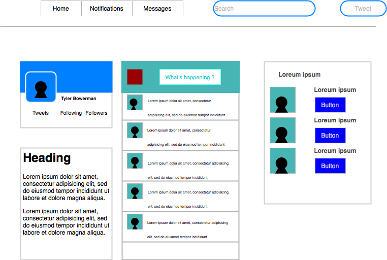

# _MyFacer_

#### _a react application built as a mock for a social media site, latest update 06/29/20 version 1_

#### By _**Mai C. and Tyler B.**_





## Description

_MyFacer is a mock social media app designed to show the user a simple recreation of the layout of most social media sites._

## Project Specifications

| Behavior | Input | Output |
|---|---|---|
|   |   |   |
|   |   |   |
|   |   |   |

## Setup/Installation Requirements

_In Terminal:_

* Navigate to where you want this application to be saved, i.e.:
```cd desktop```
* Clone the file from GitHub with HTTPS
```git clone https://github.com/kwicz/beep-boop.git```
* Open file in your preferred text editor
* On Mac: ```open -a {your text editor} beep-boop```
* On Windows: ```beep-boop```

_To Download Manually:_

* Navigate to https://github.com/kwicz/beep-boop.
* Click green "Clone or Download" button.
* Click "Download ZIP".
* Click downloaded file to unzip.
* Open folder called "beep-boop-master".
* Right click "index.html" and select your preferred browser or text editor.

## Known Bugs

_No known bugs at this time._

## Support and contact details

_Have a bug or an issue with this application? [Open a new issue](https://github.com/LonleyBuzzyBee/MyFacer/issues) here on GitHub._

## Technologies Used

_React_
_Javascript_
_HTML_
_CSS_
_Diagram.Drawio_

### License

[MIT](https://choosealicense.com/licenses/mit/)

Copyright (c) 2020 **_Tyler B., Mai C._**


<!--  -->